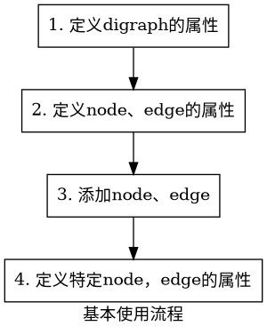
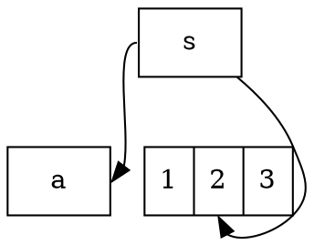

> 本仓库用于记录学习内容
> 本文件用于记录常用的命令或语法
# 语法
## Markdown
1. 文本中间插入用`shutdown -r -t 0`  
2. 行内公式$f(x)=p$  
3. 行间公式
$$
f(x)=\beta\alpha^2_n\\m
f(x)=abc.\\
x=\frac{-b\pm\sqrt{b^2-4ac}}{2a}
$$
4. 链接[跳转到](./.笔记.md)
## 正则表达式
    正则
    限定符：?, *, +, (){}
    ? 次数[0,1]，如used?表示use或used 
    * 次数[0,+∞]，如ab*c可以表示ac, abc, abbc等
    + 次数[1,+∞]，
    {} 可以指定出现多少次, a{2,6}, b{3,}, c{4}, (abc){5}
    或运算符：|
    (cat|dog) 表示cat或dog
    字符类：[]+
    表示由括号种的字符组成，如：[abc]+可以匹配到acccb, ac, b等单词 [a-zA-Z0-9]+表示所有字母数字 [^0-9]表示所有非数字
    元字符
    \d 数字
    \w 单词 （英文，数字和下划线）
    \s 空白符 （tab和换行）
    \D 非数字
    \W 非单词
    \S 非空白符
    \b是一个定位符，它表示单词的边界，也就是单词和空格或标点符号之间的位置12。例如，\bcat\b可以匹配到"The cat is cute."中的"cat"，但不能匹配到"concatenate"中的"cat"
    . 任意字符（不包括换行符）
    ^ 匹配行首 ^a表示行首的a
    $ 匹配行尾 b$表示行尾的b
    贪婪和懒惰匹配
    限定符后面加?为懒惰模式，不加为贪婪模式。懒惰模式会匹配最少的内容。比如对a321b234b进行匹配，a.*b是a321b234b，a.*?b是a321b
## DOT
> 一般以`.gv`或`.dot`格式保存，使用graphviz工具包生成图片：`dot -Tsvg -Kdot input.gv -o outpu.svg`或`dot -Tsvg -O input.gv`
DOT语言的基本使用流程：


 图：

- graph： 1）`digraph {...}` 定义有向图；2）`graph {...}`定义无向图；
- subgraph：`subgraph {...}`定义子图；
- cluster subgraph： `subgraph cluster_xxx {...}`定义的代码块，会被当成聚集子图渲染。
- `ranksep` : 相邻层级之间的距离
- `nodesep` : 同一个层级中的相邻节点的距离，单位为英寸（=2.54 cm)。
- `rankdir`: rank的指向，如 LR (left to right) or RL，或者 TB （top to bottom） or BT;
-  `size`: 用"x,y"表示长宽

节点：

- `shape`属性来设置节点的形状，可以是`record`（由label内容决定）、`box`（矩形）、`circle`（圆形）、`triangle`（三角形）等。
- `label`属性的语法结构如下：
不同的字段使用`|`隔开；
字段的 portname 使用 `<...>`尖括号括起来；
在`{...}`中的内容，在水平和垂直布局之间翻转，取决于 graph 的 rankdir 属性。

```dot
digraph structs {
    node[shape=record];
    graph[rankdir=TB];

    struct1[label="<f0> left|<f1> mid&#92; dle|<f2> right"];
    struct2[label="<f0> one|<f1> two"];
    struct3[label="hello&#92;nworld |{ b |{c|<here> d|e}| f}| g | h"];
    struct1:f1 -> struct2:f0;
    struct1:f2 -> struct3:here;
}
```

- `style`属性用于修改`节点`的外观，当前，支持8种类型的 style：
`filled` : 此值指示应填充节点的内部。使用的颜色是 fillcolor 定义的，若 fillcolor 属性未定义，则使用 color 属性的颜色。对于未填充的节点，节点内部对当前图形或簇背景色的任何颜色都是透明的。请注意，点形状始终是填充的。
`invisible` : 不可见。设置此样式会导致节点根本不显示。请注意，节点仍用于布局图形。
`diagonals`: 斜线 。“斜线”样式会导致在节点多边形的顶点附近绘制小斜线。
`rounded` ：圆形的，使节点的边变得圆滑，可以作用在 record 形状上。
`dashed` ： 使节点的边变为虚线；
`dotted` ： 使节点的边变为点线；
`solid` ： 使节点的边变为直线，默认属性；
`bold` : 使节点的边线加粗。
- `port`属性是指节点连接另一个节点的线条端点位置，端口的位置有8种，分别为节点的东、南、西、北、东南、东北、西南、西北，属性的值分别为`e, s, w, n, se, ne, sw, nw`
```cpp
digraph G {
  node[shape=record]
  b[label="1|<f>2|3"]
  s -> a:e [tailport = w];//源节点为w端点指向目标的e端点
  s -> b:f:s //指向b的f端口的s端点
}
```


示例代码：
```cpp
// 这是一个有向图的示例
digraph G {
  // 设置图形的属性
  graph [label="Example of dot language", fontsize=20, fontcolor=blue, bgcolor=white, size="8,6", rankdir=UB];
  // 设置节点的默认属性
  node [shape=ellipse, color=red, fontname="Courier"];
  // 设置边的默认属性
  edge [style=dashed, color=green];
  // 定义节点和边
  A [label="Node A"]; // 可以单独设置节点的属性
  B [shape=box]; // 可以覆盖默认属性
  C;
  D [label="Node D", shape=diamond, color=black, fillcolor=yellow, style=filled]; // 可以使用更多的属性
  A -> B; // 使用默认的边属性
  A -> C [label="Edge A-C", dir=both]; // 可以单独设置边的属性，比如标签和方向
  B -> D [weight=2]; // 可以设置边的权重，影响布局
  C -> D [color=blue, penwidth=3]; // 可以设置边的颜色和宽度
}
```

## Plantuml
> 通常保存为`.puml`格式，需要用`graphviz`工具包和官方提供的`plantuml.jar`包来转换为图片：`java -jar plantuml.jar -tsvg input.puml output.svg`或`java -jar plantuml.jar -tsvg input.puml`
## LaTex
### 利用LaTeX编写文档
#### 文档类型
TeX有多种文档类型可选，笔者较常用的有如下几种类型：

- 对于英文，可以用`book`、`article`和`beamer`；
- 对于中文，可以用`ctexbook`、`ctexart`和`ctexbeamer`，这些类型自带了对中文的支持。

不同的文件类型，编写的过程中也会有一定的差异，如果直接修改文件类型的话，甚至会报错。以下统一选用`ctexart`。在编辑框第一行，输入如下内容来设置文件类型：

```tex
\documentclass{ctexart}
```

另外，一般也可以在`\documentclass`处设置基本参数，笔者通常设置默认字体大小为12pt，纸张大小为A4，单面打印。需要将第一行的内容替换为：

```tex
\documentclass[12pt, a4paper, oneside]{ctexart}
```

文件的正文部分需要放入document环境中，在document环境外的部分不会出现在文件中。

```tex
\documentclass[12pt, a4paper, oneside]{ctexart}

\begin{document}

这里是正文. 

\end{document}
```

#### 宏包

为了完成一些功能（如定理环境），还需要在导言区，也即document环境之前加载宏包。加载宏包的代码是`\usepackage{}`。本份教程中，与数学公式与定理环境相关的宏包为`amsmath`、`amsthm`、`amssymb`，用于插入图片的宏包为`graphicx`，代码如下：

```tex
\usepackage{amsmath, amsthm, amssymb, graphicx}
```

另外，在加载宏包时还可以设置基本参数，如使用超链接宏包`hyperref`，可以设置引用的颜色为黑色等，代码如下：

```tex
\usepackage[bookmarks=true, colorlinks, citecolor=blue, linkcolor=black]{hyperref}
```

#### 标题

标题可以用`\title{}`设置，作者可以用`\author`设置，日期可以用`\date{}`设置，这些都需要放在导言区。为了在文档中显示标题信息，需要使用`\maketitle`。例如：

```tex
\documentclass[12pt, a4paper, oneside]{ctexart}
\usepackage{amsmath, amsthm, amssymb, graphicx}
\usepackage[bookmarks=true, colorlinks, citecolor=blue, linkcolor=black]{hyperref}

% 导言区

\title{我的第一个\LaTeX 文档}
\author{Dylaaan}
\date{\today}

\begin{document}

\maketitle

这里是正文. 

\end{document}
```

#### 正文

正文可以直接在document环境中书写，没有必要加入空格来缩进，因为文档默认会进行首行缩进。相邻的两行在编译时仍然会视为同一段。在LaTeX中，另起一段的方式是使用一行相隔，例如：

```tex
我是第一段. 

我是第二段.
```

这样编译出来就是两个段落。在正文部分，多余的空格、回车等等都会被自动忽略，这保证了全文排版不会突然多出一行或者多出一个空格。另外，另起一页的方式是：

```tex
\newpage
```

笔者在编写文档时，为了保证美观，通常将中文标点符号替换为英文标点符号（需要注意的是英文标点符号后面还有一个空格），这比较适合数学类型的文档。

在正文中，还可以设置局部的特殊字体：

| 字体   | 命令        |
| ---- | --------- |
| 直立   | \textup{} |
| 意大利  | \textit{} |
| 倾斜   | \textsl{} |
| 小型大写 | \textsc{} |
| 加宽加粗 | \textbf{} |

#### 章节

对于`ctexart`文件类型，章节可以用`\section{}`和`\subsection{}`命令来标记，例如：

```tex
\documentclass[12pt, a4paper, oneside]{ctexart}
\usepackage{amsmath, amsthm, amssymb, graphicx}
\usepackage[bookmarks=true, colorlinks, citecolor=blue, linkcolor=black]{hyperref}

% 导言区

\title{我的第一个\LaTeX 文档}
\author{Dylaaan}
\date{\today}

\begin{document}

\maketitle

\section{一级标题}

\subsection{二级标题}

这里是正文. 

\subsection{二级标题}

这里是正文. 

\end{document}
```

#### 目录

在有了章节的结构之后，使用`\tableofcontents`命令就可以在指定位置生成目录。通常带有目录的文件需要编译两次，因为需要先在目录中生成.toc文件，再据此生成目录。

```tex
\documentclass[12pt, a4paper, oneside]{ctexart}
\usepackage{amsmath, amsthm, amssymb, graphicx}
\usepackage[bookmarks=true, colorlinks, citecolor=blue, linkcolor=black]{hyperref}

% 导言区

\title{我的第一个\LaTeX 文档}
\author{Dylaaan}
\date{\today}

\begin{document}

\maketitle

\tableofcontents

\section{一级标题}

\subsection{二级标题}

这里是正文. 

\subsection{二级标题}

这里是正文. 

\end{document}
```

#### 图片

插入图片需要使用`graphicx`宏包，建议使用如下方式：

```tex
\begin{figure}[htbp]
    \centering
    \includegraphics[width=8cm]{图片.jpg}
    \caption{图片标题}
\end{figure}
```

其中，`[htbp]`的作用是自动选择插入图片的最优位置，`\centering`设置让图片居中，`[width=8cm]`设置了图片的宽度为8cm，`\caption{}`用于设置图片的标题。

#### 表格

LaTeX中表格的插入较为麻烦，可以直接使用[Create LaTeX tables online – TablesGenerator.com](https://link.zhihu.com/?target=https%3A//www.tablesgenerator.com/%23)来生成。建议使用如下方式：

```tex
\begin{table}[htbp]
    \centering
    \caption{表格标题}
    \begin{tabular}{ccc}
        1 & 2 & 3 \\
        4 & 5 & 6 \\
        7 & 8 & 9
    \end{tabular}
\end{table}
```

#### 列表

LaTeX中的列表环境包含无序列表`itemize`、有序列表`enumerate`和描述`description`，以`enumerate`为例，用法如下：

```tex
\begin{enumerate}
    \item 这是第一点; 
    \item 这是第二点;
    \item 这是第三点. 
\end{enumerate}
```

另外，也可以自定义`\item`的样式：

```tex
\begin{enumerate}
    \item[(1)] 这是第一点; 
    \item[(2)] 这是第二点;
    \item[(3)] 这是第三点. 
\end{enumerate}
```

#### 定理环境

定理环境需要使用`amsthm`宏包，首先在导言区加入：

```text
\newtheorem{theorem}{定理}[section]
```

其中`{theorem}`是环境的名称，`{定理}`设置了该环境显示的名称是“定理”，`[section]`的作用是让`theorem`环境在每个section中单独编号。在正文中，用如下方式来加入一条定理：

```tex
\begin{theorem}[定理名称]
    这里是定理的内容. 
\end{theorem}
```

其中`[定理名称]`不是必须的。另外，我们还可以建立新的环境，如果要让新的环境和`theorem`环境一起计数的话，可以用如下方式：

```tex
\newtheorem{theorem}{定理}[section]
\newtheorem{definition}[theorem]{定义}
\newtheorem{lemma}[theorem]{引理}
\newtheorem{corollary}[theorem]{推论}
\newtheorem{example}[theorem]{例}
\newtheorem{proposition}[theorem]{命题}
```

另外，定理的证明可以直接用`proof`环境。

#### 页面

最开始选择文件类型时，我们设置的页面大小是a4paper，除此之外，我们也可以修改页面大小为b5paper等等。

一般情况下，LaTeX默认的页边距很大，为了让每一页显示的内容更多一些，我们可以使用`geometry`宏包，并在导言区加入以下代码：

```tex
\usepackage{geometry}
\geometry{left=2.54cm, right=2.54cm, top=3.18cm, bottom=3.18cm}
```

另外，为了设置行间距，可以使用如下代码：

```tex
\linespread{1.5}
```

#### 页码

默认的页码编码方式是阿拉伯数字，用户也可以自己设置为小写罗马数字：

```tex
\pagenumbering{roman}
```

另外，`aiph`表示小写字母，`Aiph`表示大写字母，`Roman`表示大写罗马数字，`arabic`表示默认的阿拉伯数字。如果要设置页码的话，可以用如下代码来设置页码从0开始：

```tex
\setcounter{page}{0}
```

### 数学公式的输入方式

#### 行内公式

行内公式通常使用`$..$`来输入，这通常被称为公式环境，例如：

```tex
若$a>0$, $b>0$, 则$a+b>0$.
```

公式环境通常使用特殊的字体，并且默认为斜体。需要注意的是，只要是公式，就需要放入公式环境中。如果需要在行内公式中展现出行间公式的效果，可以在前面加入`\displaystyle`，例如

```tex
设$\displaystyle\lim_{n\to\infty}x_n=x$.
```

#### 行间公式

行间公式需要用`$$..$$`来输入，笔者习惯的输入方式如下：

```tex
若$a>0$, $b>0$, 则
$$
a+b>0.
$$
```

这种输入方式的一个好处是，这同时也是Markdown的语法。需要注意的是，行间公式也是正文的一部分，需要与正文连贯，并且加入标点符号。

关于具体的输入方式，可以参考[在线LaTeX公式编辑器-编辑器 (latexlive.com)](https://link.zhihu.com/?target=https%3A//www.latexlive.com/)，在这里只列举一些需要注意的。

#### 上下标

上标可以用`^`输入，例如`a^n`，效果为  ；下标可以用`_`来输入，例如`a_1`，效果为  。上下标只会读取第一个字符，如果上下标的内容较多的话，需要改成`^{}`或`_{}`。

#### 分式

分式可以用`\dfrac{}{}`来输入，例如`\dfrac{a}{b}`，效果为  。为了在行间、分子、分母或者指数上输入较小的分式，可以改用`\frac{}{}`，例如`a^\frac{1}{n}`，效果为  。

#### 括号

括号可以直接用`(..)`输入，但是需要注意的是，有时候括号内的内容高度较大，需要改用`\left(..\right)`。例如`\left(1+\dfrac{1}{n}\right)^n`，效果是  。

在中间需要隔开时，可以用`\left(..\middle|..\right)`。

另外，输入大括号{}时需要用`\{..\}`，其中`\`起到了转义作用。

#### 加粗

对于加粗的公式，建议使用`bm`宏包，并且用命令`\bm{}`来加粗，这可以保留公式的斜体。

#### 大括号

在这里可以使用`cases`环境，可以用于分段函数或者方程组，例如

```tex
$$
f(x)=\begin{cases}
    x, & x>0, \\
    -x, & x\leq 0.
\end{cases}
$$
```

效果为

#### 多行公式

多行公式通常使用`aligned`环境，例如

```tex
$$
\begin{aligned}
a & =b+c \\
& =d+e
\end{aligned}
$$
```

效果为

#### 矩阵和行列式

矩阵可以用`bmatrix`环境和`pmatrix`环境，分别为方括号和圆括号，例如

```tex
$$
\begin{bmatrix}
    a & b \\
    c & d
\end{bmatrix}
$$
```

效果为  。如果要输入行列式的话，可以使用`vmatrix`环境，用法同上。

# 工具
## git
初始化
```bash
# git全局设置
git config --global user.name "yourname"
git config --global user.email "youremail@gmail.com"
git config --global --add safe.directory /opt/my-project #添加安全目录
ssh-keygen -t rsa -C "your_email@example.com" #生成ssh公钥
# 创建库
git init #创建新库，--bare参数表示不生成.git操作空间
git clone -b main git@10.0.1.11/home/git/repo1 #从远程克隆库，-b指定分支
# 先压缩再传输，取值[-1,9]，-1默认压缩库，0不压缩
git config --add core.compression 9
# 和远程仓库建立连接，origin是连接的代号，可以是任意名称
git remote add origin git@github.com:rineikou/repo1.git
git remote add -f origin http://~.git # -f参数获取远程仓库的文件和分支等信息
# 建立分支追踪关系
git branch --set-upstream-to=origin/master master

# 本地创建空仓库和远程同步，最好保持本地仓库时空的
git init
git remote add origin [远程仓库连接地址] #建立本地仓库和远程仓库的连接。
git pull origin master #把远程仓库的master分支合并到当前分支。
git push origin -u master #建立分支追踪，把当前分支推送到远程仓库的master分支。
```
日常操作
```bash
# 提交到本地仓库
git add 文件名 #添加文件，用.表示全部添加，git add .
git commit 文件名 -m "提交代码备注" #提交文件
git commit -a -m "提交代码备注" #提交所有文件
# 同步到远程仓库master分支
git push -u origin master
# 提交所有文件到远程连接origin
git add .
git commit -m "提交代码备注" 
git push origin 
#push到指定分支
git branch -a #查看所有分支（绿色为本地分支，红色为远程分支）
git checkout -b dev origin/dev #在本地新建dev分支，关联远程origin/dev分支，并切换到本地的dev分支，进行开发
git add .
git commit -m ''
git push origin dev #提交新代码到远程仓库的dev分支
# 检出tag
git checkout tag_name #检出tag
git checkout -b <branch_name> <tag_name>
# 查看差异
git diff --stat master origin/master
```
其他操作 
```shell
## 添加submodule
git submodule add -b master <远程仓库地址> <本地路径>
## 拉取带有submodule的仓库
# 仓库一起拉取：
git clone --recurse-submodules 父仓库地址
# 分开拉取：
git clone 父仓库地址
git submodule init // 初始化子模块
git submodule update // 更新子模块与主仓库中的子模块代码同步
# or
git submodule update --init
# or 嵌套的(子仓库中包含子仓库)
git submodule update --init --recursive
## 更新submodule
git pull
git status
git submodule update --remote
git submodule foreach && git submodule update#有多层submodule时使用
# rebase
git pull --rebase origin master
git pull=git fetch 和 git merge
git pull --rebase =git fetch 和 git rebese
rebase会把远程的提交历史添加到本地的提交历史后面，最后再添加上本地的最后一次提交。例如原来是：
A—B—C master
D—E origin/master
合并后变成
A—B—D—E—C master
origin/master
保证了历史的线性，避免不必要的合并和提交。
```
github相关
>加速器:  
steampp.net	hosts代理模式需要443端口  
GitHub搜索:  
in:name xxx #按照项目名/仓库名搜索（大小写不敏感）  
in:readme xxx #大小写不敏感  
in:decription xxx #大小写不敏感  
stars:>xxx  
forks:>xxx  
language:xxx  
pushed:>yyyy-mm-dd  
awesome xxx #找百科大全  
xxx sample #找例子  
xxx starter/xxx boilerplate #找空项目架子  
xxx tutorial #找教程  
例子：  
in:name spring boot stars:>1000 pushed:>2020-09-20 fork:>2000  
关键字spring boot 点赞数>1000 更新时间2020-09-20之后 拷贝人数2000  
## 视频处理
```shell
# 测试视频 https://www.youtube.com/watch?v=NKYqJ3UvjIk
# 合并音频和视频：
ffmpeg -i video.mp4 -i audio.wav -c:v copy -c:a aac output.mp4
# 单独提取出封面,将第3个流，第一个附件转换成 cover.png 
ffmpeg -i input.mkv -map 0:2 -c copy -update 1 cover.png
# 转换成mp4(aac,avc)
ffmpeg -i input.mkv -c:a aac -c:v libx264 output.mp
# 转换png封面，mkv封装 
yt-dlp -f ba+bv --merge-output-format mkv --all-subs --embed-subs --embed-thumbnail --convert-thumbnails png --embed-chapters --add-metadata --compat-options no-live-chat 
# 无转换
yt-dlp --all-subs --embed-subs --embed-thumbnail --embed-chapters --add-metadata --compat-options no-live-chat 
# 用这个设置下最高质量 vp9+opus+mp4 的组合，并写入元数据和封面图。因为绝大多数视频都有 vp9 版本，av1 在老视频上没有，容器选 mp4 是因为 vp9 默认用的 webm 容器不支持插入封面，mp4 串流支持比较广泛，不在意的话 mkv 也行。
yt-dlp --embed-thumbnail \
--embed-chapters \
--add-metadata \
--merge-output-format mp4 \
-f bv[vcodec^=vp9]+ba[acodec=opus] \
-o youtube_%(title)s_%(channel)s(%(channel_id)s)_%(id)s.%(ext)s \
--proxy <Proxy URL> \
<VideoURL>
```
## ftp
### 安装
```bash
#ftp用户禁用ssh
vim /etc/passwd   shell改为/sbin/nologin
vim /etc/shells   增加/sbin/nologin
#安装ftp,使用被动模式
yum install vsftpd -y
vim /etc/vsftpd/vsftpd.conf
```
```conf
#改
anonymous_enable=NO
#增加
chroot_local_user=YES
chroot_list_enable=YES
chroot_list_file=/etc/vsftpd/chroot_list
xferlog_file=/var/log/xferlog
allow_writeable_chroot=YES
listen_port=60021
pasv_enable=YES
pasv_min_port=65400
pasv_max_port=65410
local_root=/opt/WaveFax7Data/AutoFaxDir/
userlist_deny=no
userlist_file=/etc/vsftpd/user_list
```

```bash
vim user_list #登录ftp
vim chroot_list #可以切换目录
vim ftpusers #黑名单
#设置selinux
getsebool -a|grep ftp #查看selinux中有哪些是关于ftp的
#设置all_ftpd_anon_write和allow_ftpd_full_access为on状态
setsebool -P allow_ftpd_anon_write on
setsebool -P allow_ftpd_full_access on
service vsftpd restart #重启FTP服务，即可正常传输文件。
```
## jenkins
### 安装
```bash
#install
sudo wget -O /etc/yum.repos.d/jenkins.repo https://pkg.jenkins.io/redhat-stable/jenkins.repo --no-check-certificate
sudo rpm --import https://pkg.jenkins.io/redhat-stable/jenkins.io.key
sudo yum upgrade
sudo yum install java-1.8.0-openjdk
sudo yum install jenkins
#start
sudo systemctl enable jenkins
sudo systemctl start jenkins
firewall-cmd --add-ports=8080/tcp --permanent
```
## 硬件
>关于多系统
>- 安装Windows前，bios关闭secure boot，否则会被windows拒绝，无法进入系统
>- 硬盘模式要选择ahci，否则无法识别
>- windows要把硬件时间设置为UTC
>网络唤醒
>- BIOS：打开网卡唤醒，把acpi电源选项设置为s5或soft off
>- windows设置：开启网卡驱动的唤醒魔包，关闭快速启动