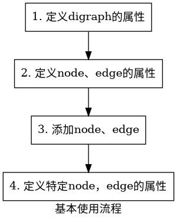
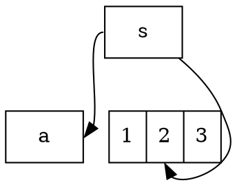

> 本仓库用于记录学习内容
> 本文件用于记录常用的命令或语法
# 语法
## Markdown
1. 文本中间插入用`shutdown -r -t 0`  
2. 行内公式$f(x)=p$  
3. 行间公式
$$
f(x)=\beta\alpha^2_n\\m
f(x)=abc.\\
x=\frac{-b\pm\sqrt{b^2-4ac}}{2a}
$$
4. 链接[跳转到](./笔记.md)
## DOT
> 一般以`.gv`或`.dot`格式保存，使用graphviz工具包生成图片：`dot -Tsvg -Kdot input.gv -o outpu.svg`或`dot -Tsvg -O input.gv`
DOT语言的基本使用流程：


 图：

- graph： 1）`digraph {...}` 定义有向图；2）`graph {...}`定义无向图；
- subgraph：`subgraph {...}`定义子图；
- cluster subgraph： `subgraph cluster_xxx {...}`定义的代码块，会被当成聚集子图渲染。
- `ranksep` : 相邻层级之间的距离
- `nodesep` : 同一个层级中的相邻节点的距离，单位为英寸（=2.54 cm)。
- `rankdir`: rank的指向，如 LR (left to right) or RL，或者 TB （top to bottom） or BT;
-  `size`: 用"x,y"表示长宽

节点：

- `shape`属性来设置节点的形状，可以是`record`（由label内容决定）、`box`（矩形）、`circle`（圆形）、`triangle`（三角形）等。
- `label`属性的语法结构如下：
不同的字段使用`|`隔开；
字段的 portname 使用 `<...>`尖括号括起来；
在`{...}`中的内容，在水平和垂直布局之间翻转，取决于 graph 的 rankdir 属性。

```dot
digraph structs {
    node[shape=record];
    graph[rankdir=TB];

    struct1[label="<f0> left|<f1> mid&#92; dle|<f2> right"];
    struct2[label="<f0> one|<f1> two"];
    struct3[label="hello&#92;nworld |{ b |{c|<here> d|e}| f}| g | h"];
    struct1:f1 -> struct2:f0;
    struct1:f2 -> struct3:here;
}
```

- `style`属性用于修改`节点`的外观，当前，支持8种类型的 style：
`filled` : 此值指示应填充节点的内部。使用的颜色是 fillcolor 定义的，若 fillcolor 属性未定义，则使用 color 属性的颜色。对于未填充的节点，节点内部对当前图形或簇背景色的任何颜色都是透明的。请注意，点形状始终是填充的。
`invisible` : 不可见。设置此样式会导致节点根本不显示。请注意，节点仍用于布局图形。
`diagonals`: 斜线 。“斜线”样式会导致在节点多边形的顶点附近绘制小斜线。
`rounded` ：圆形的，使节点的边变得圆滑，可以作用在 record 形状上。
`dashed` ： 使节点的边变为虚线；
`dotted` ： 使节点的边变为点线；
`solid` ： 使节点的边变为直线，默认属性；
`bold` : 使节点的边线加粗。
- `port`属性是指节点连接另一个节点的线条端点位置，端口的位置有8种，分别为节点的东、南、西、北、东南、东北、西南、西北，属性的值分别为`e, s, w, n, se, ne, sw, nw`
```cpp
digraph G {
  node[shape=record]
  b[label="1|<f>2|3"]
  s -> a:e [tailport = w];//源节点为w端点指向目标的e端点
  s -> b:f:s //指向b的f端口的s端点
}
```


示例代码：
```cpp
// 这是一个有向图的示例
digraph G {
  // 设置图形的属性
  graph [label="Example of dot language", fontsize=20, fontcolor=blue, bgcolor=white, size="8,6", rankdir=UB];
  // 设置节点的默认属性
  node [shape=ellipse, color=red, fontname="Courier"];
  // 设置边的默认属性
  edge [style=dashed, color=green];
  // 定义节点和边
  A [label="Node A"]; // 可以单独设置节点的属性
  B [shape=box]; // 可以覆盖默认属性
  C;
  D [label="Node D", shape=diamond, color=black, fillcolor=yellow, style=filled]; // 可以使用更多的属性
  A -> B; // 使用默认的边属性
  A -> C [label="Edge A-C", dir=both]; // 可以单独设置边的属性，比如标签和方向
  B -> D [weight=2]; // 可以设置边的权重，影响布局
  C -> D [color=blue, penwidth=3]; // 可以设置边的颜色和宽度
}
```

## Plantuml
> 通常保存为`.puml`格式，需要用`graphviz`工具包和官方提供的`plantuml.jar`包来转换为图片：`java -jar plantuml.jar -tsvg input.puml output.svg`或`java -jar plantuml.jar -tsvg input.puml`
## LaTex

# 操作
## git
初始化
```bash
# git全局设置
git config --global user.name "yourname"
git config --global user.email "youremail@gmail.com"
git config --global --add safe.directory /opt/my-project #添加安全目录
ssh-keygen -t rsa -C "your_email@example.com" #生成ssh公钥
# 创建库
git init #创建新库，--bare参数表示不生成.git操作空间
git clone -b main git@10.0.1.11/home/git/repo1 #从远程克隆库，-b指定分支
#先压缩再传输，取值[-1,9]，-1默认压缩库，0不压缩
git config --add core.compression 9
#和远程仓库建立连接，origin是连接的代号，可以是任意名称
git remote add origin git@github.com:rineikou/repo1.git
git remote add -f origin http://~.git # 获取远程仓库的文件和分支等信息
```
日常操作
```bash
# 提交到本地仓库
git add 文件名 #添加文件，用.表示全部添加，git add .
git commit 文件名 -m "提交代码备注" #提交文件
git commit -a -m "提交代码备注" #提交所有文件
# 同步到远程仓库master分支
git push -u origin master
# 提交所有文件到远程连接origin
git add .
git commit -m "提交代码备注" 
git push origin 
#push到指定分支
git branch -a #查看所有分支（绿色为本地分支，红色为远程分支）
git checkout -b dev origin/dev #在本地新建dev分支，关联远程origin/dev分支，并切换到本地的dev分支，进行开发
git add .
git commit -m ''
git push origin dev #提交新代码到远程仓库的dev分支
# 检出tag
git checkout tag_name #检出tag
git checkout -b <branch_name> <tag_name>
# 查看差异
git diff --stat master origin/master
```
其他操作 
```shell
## 添加submodule
git submodule add -b master <远程仓库地址> <本地路径>
## 拉取带有submodule的仓库
# 仓库一起拉取：
git clone --recurse-submodules 父仓库地址
# 分开拉取：
git clone 父仓库地址
git submodule init // 初始化子模块
git submodule update // 更新子模块与主仓库中的子模块代码同步
# or
git submodule update --init
# or 嵌套的(子仓库中包含子仓库)
git submodule update --init --recursive
## 更新submodule
git pull
git status
git submodule update --remote
git submodule foreach && git submodule update#有多层submodule时使用
```
github相关
>加速器:  
steampp.net	hosts代理模式需要443端口  
GitHub搜索:  
in:name xxx #按照项目名/仓库名搜索（大小写不敏感）  
in:readme xxx #大小写不敏感  
in:decription xxx #大小写不敏感  
stars:>xxx  
forks:>xxx  
language:xxx  
pushed:>yyyy-mm-dd  
awesome xxx #找百科大全  
xxx sample #找例子  
xxx starter/xxx boilerplate #找空项目架子  
xxx tutorial #找教程  
例子：  
in:name spring boot stars:>1000 pushed:>2020-09-20 fork:>2000  
关键字spring boot 点赞数>1000 更新时间2020-09-20之后 拷贝人数2000  
